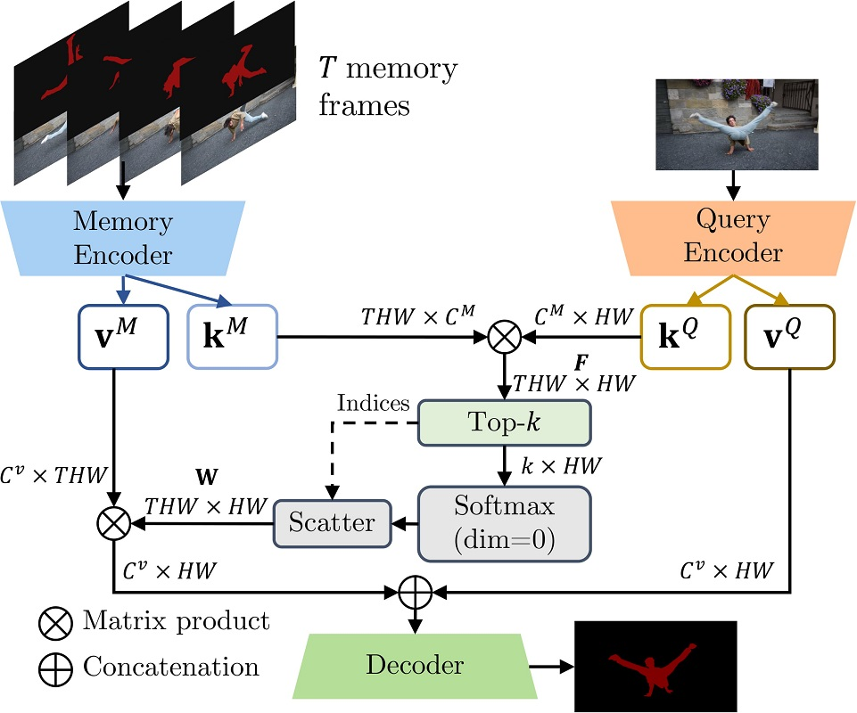

# MiVOS (CVPR 2021) - Mask Propagation

[Ho Kei Cheng](https://hkchengrex.github.io/), Yu-Wing Tai, Chi-Keung Tang

[[arXiv]](https://arxiv.org/abs/2103.07941) [[Paper PDF]](https://arxiv.org/pdf/2103.07941.pdf) [[Project Page]](https://hkchengrex.github.io/MiVOS/) [[Papers with Code]](https://paperswithcode.com/task/semi-supervised-video-object-segmentation)

## Newer: check out our new work on long-term VOS [XMem](https://github.com/hkchengrex/XMem). It also includes an interactive GUI!

## New: see [STCN](https://github.com/hkchengrex/STCN) for a better and faster algorithm. See also [MiVOS+STCN](https://github.com/hkchengrex/MiVOS/tree/MiVOS-STCN).

 

This repo implements an improved version of the [Space-Time Memory Network (STM)](https://arxiv.org/abs/1904.00607) and is part of the accompanying code of [Modular Interactive Video Object Segmentation: Interaction-to-Mask, Propagation and Difference-Aware Fusion (MiVOS)](https://hkchengrex.github.io/MiVOS/). It can be used as:

1. A tool for propagating masks across video frames. [Results](#main-results)
2. An integral component for reproducing and/or improving the performance in MiVOS.
3. A tool that can compute dense correspondences between two frames. [Tutorial](#correspondences)

## Overall structure and capabilities

| | [MiVOS](https://github.com/hkchengrex/MiVOS) | [Mask-Propagation](https://github.com/hkchengrex/Mask-Propagation)| [Scribble-to-Mask](https://github.com/hkchengrex/Scribble-to-Mask)  |
| ------------- |:-------------:|:-----:|:-----:|
| DAVIS/YouTube semi-supervised evaluation | :x: | :heavy_check_mark: | :x: |
| DAVIS interactive evaluation | :heavy_check_mark: | :x: | :x: |
| User interaction GUI tool | :heavy_check_mark: | :x: | :x: |
| Dense Correspondences | :x: | :heavy_check_mark: | :x: |
| Train propagation module | :x: | :heavy_check_mark: | :x: |
| Train S2M (interaction) module | :x: | :x: | :heavy_check_mark: |
| Train fusion module | :heavy_check_mark: | :x: | :x: |
| Generate more synthetic data | :heavy_check_mark: | :x: | :x: |

## Framework



## Requirements

We used these packages/versions in the development of this project. It is likely that higher versions of the same package will also work. This is not an exhaustive list -- other common python packages (e.g. pillow) are expected and not listed.

- PyTorch `1.7.1`
- torchvision `0.8.2`
- OpenCV `4.2.0`
- progressbar
- [thinspline](https://github.com/cheind/py-thin-plate-spline) for training (`pip install git+https://github.com/cheind/py-thin-plate-spline`)
- gitpython for training
- gdown for downloading pretrained models

Refer to the official [PyTorch guide](<https://pytorch.org/>) for installing PyTorch/torchvision. The rest can be installed by:

`pip install progressbar2 opencv-python gitpython gdown git+https://github.com/cheind/py-thin-plate-spline`

## Main Results

### Semi-supervised VOS

FPS is amortized, computed as total processing time / total number of frames irrespective of the number of objects, aka multi-object FPS. All times are measured on an RTX 2080 Ti with IO time excluded. Pre-computed results and evaluation outputs (either from local evaluation or CodaLab output log) are also provided. All evaluations are done in 480p resolution.

(Note: This implementation is not optimal in speed. There are ways to speed it up but we wanted to keep it in its simplest PyTorch form.)

[Find all the precomputed results here](https://drive.google.com/drive/folders/17wWbe0WlGdxTZj5YmHS5xuMXymaERr0L?usp=sharing).

**DAVIS 2016 val:**

Produced using `eval_davis_2016.py`

| Model | Top-k? | J | F | J&F | FPS | Pre-computed results |
| --- |:--:|:--:|:---:|:---:|:---:|---|
| Without BL pretraining | :x: | 87.1 | 89.0 | 88.1 | 15.5 | D16_s02_notop |
| Without BL pretraining | :heavy_check_mark: | 87.8 | 90.0 | 88.9 | 16.9 | D16_s02 |
| With BL pretraining | :x: | 89.9 | 92.2 | 91.0 | 15.5 | D16_s012_notop |
| With BL pretraining | :heavy_check_mark: | 89.7 | 92.4 | 91.0 | 16.9 | D16_s012 |

**DAVIS 2017 val:**

Produced using `eval_davis.py`

| Model | Top-k? | J | F | J&F | FPS | Pre-computed results |
| --- |:--:|:--:|:---:|:---:|:---:|---|
| Without BL pretraining | :x: | 78.8 | 84.2 | 81.5 | 9.75 | D17_s02_notop |
| Without BL pretraining | :heavy_check_mark: | 80.5 | 85.8 | 83.1 | 11.2 | D17_s02 |
| With BL pretraining | :x: | 81.1 | 86.5 | 83.8 | 9.75 | D17_s012_notop |
| With BL pretraining | :heavy_check_mark: | 81.7 | 87.4 | 84.5 | 11.2 | D17_s012 |

For YouTubeVOS val and DAVIS test-dev we also tried the kernelized memory (called KM in our code) technique described in [Kernelized Memory Network for Video Object Segmentation](https://arxiv.org/abs/2007.08270). It works nicely with our top-k filtering.

**YouTubeVOS val (2018):**
| Model | Kernel Memory (KM)? | Overall Score | J-Seen | J-Unseen | F-Seen | F-Unseen | Pre-computed results |
| --- |:--:|:---:|:---:|:---:|:---:|:---:|---|
| Without BL30K, k=20 | :x: | 80.4 | 80.0 | 74.8 | 84.6 | 82.4 | YV_2018_val_s02 |
| With BL30K, k=20 | :x: | 82.6 | 81.1 | 77.7 | 85.6 | 86.2 | YV_2018_val_s012 |

**YouTubeVOS val (2019):**

Produced using `eval_youtube.py`

| Model | Kernel Memory (KM)? | Overall Score | J-Seen | J-Unseen | F-Seen | F-Unseen | Pre-computed results |
| --- |:--:|:---:|:---:|:---:|:---:|:---:|---|
| Full model with top-k | :x: | 82.0 | 80.6 | 77.3 | 84.7 | 85.5 | YV_val_s012 |
| Full model with top-k | :heavy_check_mark: | 82.8 | 81.6 | 77.7 | 85.8 | 85.9 | YV_val_s012_km |

**DAVIS 2017 test-dev:**

Produced using `eval_davis.py`

| Model | Kernel Memory (KM)? | J | F | J&F | Pre-computed results |
| --- |:--:|:---:|:---:|:---:|---|
| Full model with top-k | :x: | 72.7 | 80.2 | 76.5 | D17_testdev_s012 |
| Full model with top-k | :heavy_check_mark: | 74.9 | 82.2 | 78.6 | D17_testdev_s012_km |

### Running them yourselves

You can look at the corresponding scripts (`eval_davis.py`, `eval_youtube.py`, etc.). The arguments tooltip should give you a rough idea of how to use them. For example, if you have downloaded the datasets and pretrained models using our scripts, you only need to specify the output path: `python eval_davis.py --output [somewhere]` for DAVIS 2017 validation set evaluation.

### Correspondences

The `W` matrix can be considered as a dense correspondence (affinity) matrix. This is in fact how we used it in the fusion module. See `try_correspondence.py` for details. We have included a small GUI there to show the correspondences (a point source is used, but a mask/tensor can be used in general).

Try it yourself: `python try_correspondence.py`.

| Source | Target |
| :---: | :---: |
|  |  |
|  |  |
|  |  |

## Pretrained models

Here we provide two pretrained models. One is pretrained on static images and transferred to main training (we call it s02: stage 0 -> stage 2); the other is pretrained on both static images and BL30K then transferred to main training (we call it s012). For the s02 model, we train it for 300K (instead of 150K) iterations in the main training stage to offset the extra training. More iterations do not help/help very little.
The script `download_model.py` automatically downloads the s012 model. Put all pretrained models in `Mask-Propagation/saves/`.

| Model | Google Drive | OneDrive |
| --- |:--:|:---:|
| s02 | [link](https://drive.google.com/file/d/12jw9b30o-mh23bXzsL0vp24UVhFko_Py/view?usp=sharing) |  [link](https://1drv.ms/u/s!AjSBKkdpxQckyx6xpVZ8mwqVxesD?e=VO7mgZ) |
| s012 | [link](https://drive.google.com/file/d/19dfbVDndFkboGLHESi8DGtuxF1B21Nm8/view?usp=sharing) |  [link](https://1drv.ms/u/s!AjSBKkdpxQckyx23RL_sYrNPSDd4?e=3kDZSy) |

## Training

### Data preparation

I recommend either softlinking (`ln -s`) existing data or use the provided `download_datasets.py` to structure the datasets as our format. `download_datasets.py` might download more than what you need -- just comment out things that you don't like. The script does not download BL30K because it is huge (>600GB) and we don't want to crash your harddisks. See below.

```bash
├── BL30K
├── DAVIS
│   ├── 2016
│   │   ├── Annotations
│   │   └── ...
│   └── 2017
│       ├── test-dev
│       │   ├── Annotations
│       │   └── ...
│       └── trainval
│           ├── Annotations
│           └── ...
├── Mask-Propagation
├── static
│   ├── BIG_small
│   └── ...
└── YouTube
    ├── all_frames
    │   └── valid_all_frames
    ├── train
    ├── train_480p
    └── valid
```

### BL30K

BL30K is a synthetic dataset rendered using ShapeNet data and Blender. For details, see [MiVOS](https://github.com/hkchengrex/MiVOS/#bl30k).

You can either use the automatic script `download_bl30k.py` or download it manually below. Note that each segment is about 115GB in size -- 700GB in total. You are going to need ~1TB of free disk space to run the script (including extraction buffer).

Google Drive is much faster in my experience. Your mileage might vary.

Manual download: [[Google Drive]](https://drive.google.com/drive/folders/1KxriFZM8Y_-KbiA3D0PaMv6LQaatKFH-?usp=sharing) [[OneDrive]](https://uillinoisedu-my.sharepoint.com/:f:/g/personal/hokeikc2_illinois_edu/ElEqJXQqaqZAqG8QROa0VesBAw4FiOl5wleP2iq_KXDPyw?e=eKMSbx)

### Training commands

`CUDA_VISIBLE_DEVICES=[a,b] OMP_NUM_THREADS=4 python -m torch.distributed.launch --master_port [cccc] --nproc_per_node=2 train.py --id [defg] --stage [h]`

We implemented training with Distributed Data Parallel (DDP) with two 11GB GPUs. Replace `a, b` with the GPU ids, `cccc` with an unused port number,  `defg` with a unique experiment identifier, and `h` with the training stage (0/1/2).

The model is trained progressively with different stages (0: static images; 1: BL30K; 2: YouTubeVOS+DAVIS). After each stage finishes, we start the next stage by loading the trained weight.

The `.pth` with `_checkpoint` as suffix is used to resume interrupted training (with `--load_model`) which is usually not needed. Typically you only need `--load_network` and load the last network weights (without `checkpoint` in its name).

One concrete example is:

Pre-training on static images: `CUDA_VISIBLE_DEVICES=0,1 OMP_NUM_THREADS=4 python -m torch.distributed.launch --master_port 9842 --nproc_per_node=2 train.py --id retrain_s0 --stage 0`

Pre-training on the BL30K dataset: `CUDA_VISIBLE_DEVICES=0,1 OMP_NUM_THREADS=4 python -m torch.distributed.launch --master_port 9842 --nproc_per_node=2 train.py --id retrain_s01 --load_network [path_to_trained_s0.pth]  --stage 1`

Main training: `CUDA_VISIBLE_DEVICES=0,1 OMP_NUM_THREADS=4 python -m torch.distributed.launch --master_port 9842 --nproc_per_node=2 train.py --id retrain_s012 --load_network [path_to_trained_s01.pth]  --stage 2`

## Details

### Files to look at

- model/network.py - Defines the core network.
- model/model.py - Training procedure.
- util/hyper_para.py - Hyperparameters that you can provide by specifying command line arguments.

### What are the differences?

While I did start building this from STM's official [evaluation code](https://github.com/seoungwugoh/STM), the official training code is not available and therefore a lot of details are missing. My own judgments are used in the engineering of this work.

- We both use the ResNet-50 backbone up to `layer3`/`res4` but there are a few minor architecture differences elsewhere (e.g. decoder, mask generation in the last layer)
- This repo does not use the COCO dataset and uses some other static image datasets instead.
- This repo picks two, instead of three objects for each training sample.
- Top-k filtering (proposed by us) is included here
- Our raw performance (without BL30K or top-k) is slightly worse than the original STM model but I believe we train with fewer resources.

## Citation

Please cite our paper if you find this repo useful!

```bibtex
@inproceedings{cheng2021mivos,
  title={Modular Interactive Video Object Segmentation: Interaction-to-Mask, Propagation and Difference-Aware Fusion},
  author={Cheng, Ho Kei and Tai, Yu-Wing and Tang, Chi-Keung},
  booktitle={CVPR},
  year={2021}
}
```

And if you want to cite the datasets:

<details> 
<summary>

bibtex

</summary>

```bibtex
@inproceedings{shi2015hierarchicalECSSD,
  title={Hierarchical image saliency detection on extended CSSD},
  author={Shi, Jianping and Yan, Qiong and Xu, Li and Jia, Jiaya},
  booktitle={TPAMI},
  year={2015},
}

@inproceedings{wang2017DUTS,
  title={Learning to Detect Salient Objects with Image-level Supervision},
  author={Wang, Lijun and Lu, Huchuan and Wang, Yifan and Feng, Mengyang 
  and Wang, Dong, and Yin, Baocai and Ruan, Xiang}, 
  booktitle={CVPR},
  year={2017}
}

@inproceedings{FSS1000,
  title = {FSS-1000: A 1000-Class Dataset for Few-Shot Segmentation},
  author = {Li, Xiang and Wei, Tianhan and Chen, Yau Pun and Tai, Yu-Wing and Tang, Chi-Keung},
  booktitle={CVPR},
  year={2020}
}

@inproceedings{zeng2019towardsHRSOD,
  title = {Towards High-Resolution Salient Object Detection},
  author = {Zeng, Yi and Zhang, Pingping and Zhang, Jianming and Lin, Zhe and Lu, Huchuan},
  booktitle = {ICCV},
  year = {2019}
}

@inproceedings{cheng2020cascadepsp,
  title={{CascadePSP}: Toward Class-Agnostic and Very High-Resolution Segmentation via Global and Local Refinement},
  author={Cheng, Ho Kei and Chung, Jihoon and Tai, Yu-Wing and Tang, Chi-Keung},
  booktitle={CVPR},
  year={2020}
}

@inproceedings{xu2018youtubeVOS,
  title={Youtube-vos: A large-scale video object segmentation benchmark},
  author={Xu, Ning and Yang, Linjie and Fan, Yuchen and Yue, Dingcheng and Liang, Yuchen and Yang, Jianchao and Huang, Thomas},
  booktitle = {ECCV},
  year={2018}
}

@inproceedings{perazzi2016benchmark,
  title={A benchmark dataset and evaluation methodology for video object segmentation},
  author={Perazzi, Federico and Pont-Tuset, Jordi and McWilliams, Brian and Van Gool, Luc and Gross, Markus and Sorkine-Hornung, Alexander},
  booktitle={CVPR},
  year={2016}
}

@inproceedings{denninger2019blenderproc,
  title={BlenderProc},
  author={Denninger, Maximilian and Sundermeyer, Martin and Winkelbauer, Dominik and Zidan, Youssef and Olefir, Dmitry and Elbadrawy, Mohamad and Lodhi, Ahsan and Katam, Harinandan},
  booktitle={arXiv:1911.01911},
  year={2019}
}

@inproceedings{shapenet2015,
  title       = {{ShapeNet: An Information-Rich 3D Model Repository}},
  author      = {Chang, Angel Xuan and Funkhouser, Thomas and Guibas, Leonidas and Hanrahan, Pat and Huang, Qixing and Li, Zimo and Savarese, Silvio and Savva, Manolis and Song, Shuran and Su, Hao and Xiao, Jianxiong and Yi, Li and Yu, Fisher},
  booktitle   = {arXiv:1512.03012},
  year        = {2015}
}
```

</details>

## External link

Congratulations to the 路过 team for winning a [TianChi VOS competition](https://tianchi.aliyun.com/competition/entrance/531873/introduction) with our framework and additional data augmentation. Their code is available here: https://github.com/mrgjbd/copy_paste_for_video_seg

Contact: <hkchengrex@gmail.com>
